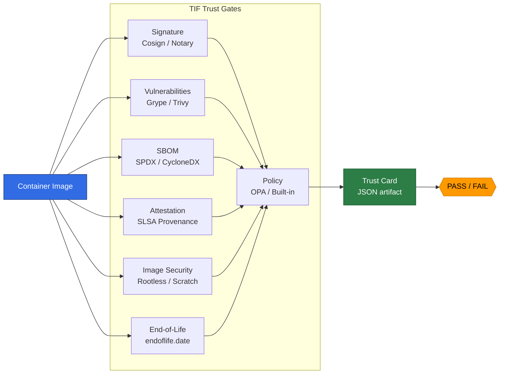

<div align="center">

# TIF

**The Trust Gate for Container Images**

One command. One artifact. Zero noise.

[](https://ghcr.io/cvemula1/tif)
[](LICENSE)
[](https://github.com/cvemula1/tif)

**TIF (Trusted Image Framework)** is an open-source CLI that verifies container image trust -- signer identity, provenance, digest immutability, SBOM, and policy -- before build or deployment.

[Quick Start](#quick-start) | [Real Results](#real-world-results) | [Trust Card](#trust-card) | [CI/CD](#cicd-integration) | [Dockerfile Security](#dockerfile-security)

</div>

---

## Why TIF?

> Scanner alert fatigue is real. **70% of CVE alerts are false positives.** 85% are in packages never loaded at runtime. Teams stop looking.

TIF cuts through the noise: one command produces a **compliance-ready Trust Card** -- a signed, scored JSON artifact stored with your image -- showing only the vulnerabilities you can actually fix.

For teams with **SOC 2, FedRAMP, or NIST 800-190** requirements: TIF's Trust Card is the auditable proof your compliance team needs.

---

## 7 Trust Gates, One Command

| Gate | What It Checks | Tool |
|:-----|:--------------|:-----|
| **Signature** | Image signed by trusted identity | Cosign (keyless or key-based) |
| **Vulnerabilities** | CVEs with severity gating + fixable-only filter | Grype / Trivy |
| **SBOM** | Software Bill of Materials attached and complete | Cosign + Syft |
| **Attestation** | SLSA provenance and build origin | slsa-verifier / Cosign |
| **Image Security** | Rootless, FROM scratch, read-only rootfs, HEALTHCHECK | Docker / Skopeo |
| **End-of-Life** | Base image EOL status via endoflife.date API | endoflife.date |
| **Policy** | Compliance frameworks (CIS, NIST, DISA STIG) | OPA/Rego or built-in |

---

## Quick Start

### Docker (recommended -- zero setup, multi-arch)

All trust tools (cosign, grype, syft, skopeo) pre-installed. Runs natively on **amd64** and **arm64** (Apple Silicon).

```bash
docker run --rm ghcr.io/cvemula1/tif verify alpine:3.20
docker run --rm ghcr.io/cvemula1/tif verify python:3.12-slim --policy-pack nist-800-190 --ci
docker run --rm ghcr.io/cvemula1/tif demo
```

**Pro tip** -- set an alias:

```bash
alias tif='docker run --rm ghcr.io/cvemula1/tif'
tif verify myapp:1.0 --only-fixable --policy-pack cis-l2 --ci
```

### pip install (coming soon)

```bash
pip install tif                                    # WIP — PyPI publishing in progress
tif demo                                          # works immediately
tif verify registry.io/myapp:1.0 --only-fixable  # full scan (needs cosign + grype)
```

---

## Real-World Results

We ran TIF against popular Docker Hub images. Here's what we found:

| Image | Score | Vulns | SBOM | EOL Status | Key Finding |
|:------|:-----:|:-----:|:----:|:-----------|:------------|
| **alpine:3.20** | 41 | 0 CVEs | 16 pkgs, 88% | EOL in 8 days | Clean but expiring soon |
| **ubuntu:24.04** | 39 | 11 (0 critical) | 94 pkgs, 100% | 2029 (LTS) | Cleanest base image |
| **python:3.12-slim** | 15 | 78 (0 critical) | 90 pkgs, 100% | Security-only | pip has fixable CVEs |
| **node:22-slim** | 12 | 1 critical | 303 pkgs, 44% | Security-only | tar CVE (CVSS 8.2) |
| **redis:7** | 15 | 5 critical | 96 pkgs, 100% | Security-only | Go stdlib CVSS 10.0 |
| **nginx:1.27** | 10 | 7 critical | 151 pkgs, 100% | **EOL'd** | openssl + libxml2 CVEs |

> Every image failed the Signature gate -- none of these official images are cosign-signed. This is the gap TIF makes visible.

### Example: `tif verify nginx:1.27`

```
╭──────────────────────── TIF Trust Card ─────────────────────────╮
│  [FAIL]  Trust Score: 10/100  —  FAIL                           │
╰──────────────────────────── nginx:1.27 ─────────────────────────╯

  Trust Gates
  ┌───────────────────┬─────────────┬──────────────────────────────────────────┐
  │ Gate              │ Verdict     │ Reason                                   │
  ├───────────────────┼─────────────┼──────────────────────────────────────────┤
  │ Signature         │ [FAIL] FAIL │ No signatures found                      │
  │ Vulnerabilities   │ [FAIL] FAIL │ 7 critical CVEs found                    │
  │ SBOM              │ [PASS] PASS │ SPDX-2.3: 151 packages, 100%            │
  │ Attestation       │ [WARN] WARN │ No provenance attestation found          │
  │ Image Security    │ [FAIL] FAIL │ Runs as root, no HEALTHCHECK             │
  │ End-of-Life       │ [FAIL] FAIL │ nginx 1.27 EOL'd on 2025-06-24          │
  │ Policy            │ [FAIL] FAIL │ Policy violations: default               │
  └───────────────────┴─────────────┴──────────────────────────────────────────┘

  Top fixable CVEs:
    CVE-2025-15467 libssl3@3.0.16 → 3.0.18  (CVSS 9.8)
    CVE-2024-56171 libxml2@2.9.14 → patched  (CVSS 9.8)

  Next steps:
    - Upgrade to nginx:1.28 or nginx:mainline
    - Fix CVEs: grype nginx:1.27 --only-fixed
    - Add USER, HEALTHCHECK, and --read-only to your Dockerfile
```

---

## Reducing Alert Fatigue

Use `--only-fixable` to see only CVEs with an available patch:

```bash
tif verify myapp:latest                  # 183 findings → team ignores scanner
tif verify myapp:latest --only-fixable   # 12 actionable → team fixes them
```

```
Vulnerabilities: 1 critical, 3 high, 8 medium (grype)
  ↳ 171 CVEs suppressed (no fix available)
Top fixable CVEs:
  CVE-2024-3094 openssl@3.0.1 → 3.0.2 (CVSS 9.8)
  CVE-2024-1234 libcurl@8.4.0 → 8.5.0 (CVSS 7.5)
```

---

## Trust Card

The Trust Card is a portable JSON artifact that captures the complete trust posture of a container image.

```bash
tif verify myapp:1.0 -o trust-card.json           # generate
tif push myapp:1.0 trust-card.json --to registry.io/myapp:1.0  # store with image
tif inspect registry.io/myapp:1.0                  # retrieve later
tif policy check trust-card.json --policy-pack cis-l2  # evaluate offline
```

**Use it to:** gate deployments, audit trail, track score trends, share with auditors.

<details>
<summary><b>Trust Card JSON schema</b></summary>

```json
{
  "schema_version": "1.0",
  "image": "registry.io/myapp",
  "digest": "sha256:...",
  "tag": "1.0",
  "tier": "hardened",
  "signature":       { "verified": true, "signer": "cosign" },
  "sbom":            { "present": true, "format": "spdx-2.3", "packages": 127 },
  "attestation":     { "present": true, "slsa_level": 3, "builder": "github-actions" },
  "vulnerabilities": { "scanned": true, "critical": 0, "high": 2 },
  "security":        { "rootless": true, "from_scratch": true, "read_only_rootfs": true },
  "compliance":      [{ "framework": "CIS-L2", "passed": true }],
  "gates":           [{ "name": "Signature", "verdict": "PASS" }],
  "verdict": "PASS",
  "trust_score": 87,
  "created_at": "2026-03-23T12:00:00Z"
}
```

</details>

<details>
<summary><b>OCI labels added by <code>tif push</code></b></summary>

```json
{
  "tif.trust-score": "87",
  "tif.verdict": "PASS",
  "tif.policy": "nist-800-190",
  "tif.scanned-at": "2026-03-23T10:00:00Z",
  "tif.critical-cves": "0",
  "tif.fixable-highs": "2",
  "tif.signed": "true",
  "tif.sbom-attached": "true"
}
```

</details>

---

## Policy Packs

Built-in compliance frameworks -- no OPA required:

| Pack | Framework | Key Checks |
|:-----|:----------|:-----------|
| `default` | Baseline | Signature verified, no critical CVEs |
| `cis-l1` | CIS Docker Benchmark L1 | Non-root, HEALTHCHECK, no critical CVEs |
| `cis-l2` | CIS Docker Benchmark L2 | + signature, read-only rootfs, no-new-privileges |
| `nist-800-190` | NIST SP 800-190 | Signature, SBOM, non-root, vuln thresholds |
| `dod-stig` | DISA STIG / FedRAMP | All above + SLSA L2+, FROM scratch |

```bash
tif verify myapp:1.0 --policy-pack nist-800-190   # built-in
tif verify myapp:1.0 --policy my-rules.rego        # custom OPA/Rego
```

---

## Trust Scoring (NIST SP 800-190 Aligned)

0--100 score mapped to NIST control families with CVSS-weighted vulnerability penalties:

| NIST Family | Control | Measures | Max |
|:------------|:--------|:---------|:---:|
| **CM** Config Mgmt | CM-3, CM-5 | Signature + transparency log | 20 |
| **RA** Risk Assessment | RA-5 | Vuln scan, CVSS-weighted penalties | 25 |
| **SA** Supply Chain | SA-12 | SBOM completeness + SLSA level | 20 |
| **AC** Access Control | AC-6 | Rootless, no-new-privileges | 15 |
| **SI** Sys Integrity | SI-7 | FROM scratch, read-only rootfs | 10 |
| **MA** Maintenance | MA-6 | Base image EOL status | 10 |

Vulnerability penalties: **Critical** -10 pts, **High** -4 pts, **Medium** -1.5 pts, **Low** -0.3 pts.

---

## CI/CD Integration

### GitHub Actions

```yaml
name: Image Trust Gate
on: [push]
jobs:
  verify:
    runs-on: ubuntu-latest
    steps:
      - uses: actions/checkout@v4
      - name: Verify image trust
        run: |
          docker run --rm ghcr.io/cvemula1/tif verify \
            ghcr.io/${{ github.repository }}:${{ github.sha }} \
            --policy-pack nist-800-190 --only-fixable --ci
```

### GitLab CI

```yaml
tif-verify:
  stage: verify
  image: ghcr.io/cvemula1/tif:latest
  script:
    - tif verify $CI_REGISTRY_IMAGE:$CI_COMMIT_SHA
        --only-fixable --policy-pack nist-800-190 --ci -o trust-card.json
  artifacts:
    paths: [trust-card.json]
    expire_in: 90 days
```

---

## Dockerfile Security

Analyze and harden Dockerfiles -- no image build needed.

```bash
tif scan-dockerfile Dockerfile              # find issues
tif harden Dockerfile -o Dockerfile.hardened # auto-fix
```

```
[WARN] 3 findings in Dockerfile

  [CRITICAL] DF-010 (line 3): Secrets in ENV are baked into the image
  [    HIGH] DF-001 (line 5): Running as root — add USER instruction
  [    HIGH] DF-006 (line 7): Exposing SSH port 22
```

**Auto-fixes applied by `tif harden`:** ADD→COPY, adds USER 65532, adds HEALTHCHECK, removes EXPOSE 22, strips secrets from ENV, fixes chmod 777→755, adds `--no-install-recommends`.

---

## Verify TIF Itself

TIF signs its own images and attaches SBOMs -- we eat our own dog food:

```bash
cosign verify \
  --certificate-identity-regexp=https://github.com/cvemula1/tif/.* \
  --certificate-oidc-issuer=https://token.actions.githubusercontent.com \
  ghcr.io/cvemula1/tif:latest
```

---

## How It Works



---

## vs. Other Tools

| Feature | TIF | Cosign | Grype | Trivy | Kyverno |
|:--------|:---:|:------:|:-----:|:-----:|:-------:|
| Signature verification | **Yes** | Yes | -- | -- | Yes |
| Vulnerability scanning | **Yes** | -- | Yes | Yes | -- |
| SBOM validation | **Yes** | Partial | -- | Yes | -- |
| SLSA attestation | **Yes** | Yes | -- | -- | Yes |
| Image hardening checks | **Yes** | -- | -- | -- | -- |
| Policy compliance | **Yes** | -- | -- | -- | Yes |
| **Unified Trust Card** | **Yes** | -- | -- | -- | -- |
| **EOL checking** | **Yes** | -- | -- | -- | -- |
| **NIST-aligned scoring** | **Yes** | -- | -- | -- | -- |
| **Dockerfile analysis** | **Yes** | -- | -- | -- | -- |
| Standalone CLI | **Yes** | Yes | Yes | Yes | -- |
| CI/CD native | **Yes** | Yes | Yes | Yes | -- |

---

<details>
<summary><b>Full CLI Reference</b></summary>

```
tif verify IMAGE [OPTIONS]        Run all trust gates on a container image
  --key PATH                      Cosign public key (default: keyless Sigstore)
  --scanner {grype,trivy}         Vulnerability scanner (default: grype)
  --policy PATH                   Custom .rego policy file
  --policy-pack NAME              Built-in policy pack (default, cis-l1, cis-l2, nist-800-190, dod-stig)
  --fail-on {critical,high,medium,low}  Vulnerability severity gate
  --max-high N                    Max high CVEs before failing (default: 10)
  --only-fixable                  Count only CVEs with an available fix
  --require-sbom                  Fail if no SBOM attached
  --require-provenance            Fail if no SLSA provenance
  --min-slsa-level {0,1,2,3,4}   Minimum SLSA level (default: 0)
  --skip GATE [GATE ...]          Skip gates: signature vulnerabilities sbom attestation image eol policy
  -f, --format {table,json,card}  Output format (default: table)
  -o, --output FILE               Write Trust Card JSON to file
  --ascii                         ASCII-safe output
  --ci                            Exit code 1 on FAIL verdict

tif inspect IMAGE                 Retrieve stored Trust Card (read-only)
tif scan-dockerfile DOCKERFILE    Analyze Dockerfile for security issues
tif harden DOCKERFILE [-o FILE]   Generate hardened Dockerfile
tif push IMAGE CARD --to DEST     Push Trust Card labels + attestation to registry
tif policy list                   List policy packs
tif policy check FILE             Evaluate Trust Card against policy
tif demo                          Sample Trust Card (no tools needed)
tif version                       Show version
```

</details>

<details>
<summary><b>Architecture</b></summary>

```
tif/
├── cli.py                        # CLI entry point
├── core/
│   ├── trust_card.py             # Trust Card schema (dataclasses)
│   ├── verifier.py               # Orchestrator — runs all gates
│   └── output.py                 # Rich table + JSON formatters
├── validators/
│   ├── signature.py              # Cosign verification
│   ├── vulnerability.py          # Grype/Trivy scanning
│   ├── sbom.py                   # SPDX/CycloneDX validation
│   ├── attestation.py            # SLSA provenance
│   ├── image.py                  # Image security inspection
│   ├── dockerfile.py             # Dockerfile static analysis
│   └── eol.py                    # End-of-Life checking
├── generators/
│   └── harden.py                 # Hardened Dockerfile generator
├── publishers/
│   └── registry.py               # OCI attestation push
└── policies/
    ├── engine.py                 # OPA/Rego + built-in evaluator
    └── packs/                    # 5 policy packs (.rego)
```

</details>

## Roadmap

- [x] **v0.1** -- 7 trust gates, NIST-aligned scoring, 5 policy packs, Dockerfile scanner/hardener, Trust Card push, multi-arch Docker image
- [ ] **v0.2** -- Notary v2 signing, SARIF output, `--only-fixable` enhancements
- [ ] **v0.3** -- Trust Card registry (store/query/trend), webhook notifications
- [ ] **v0.4** -- ML-based risk scoring, auto-remediation suggestions

## Contributing

See [CONTRIBUTING.md](CONTRIBUTING.md) for development setup, commit conventions, and how to add new trust gates.

## Related Projects

- **[NHInsight](https://github.com/cvemula1/NHInsight)** -- discover risky non-human identities across cloud and CI/CD
- **[ChangeTrail](https://github.com/cvemula1/ChangeTrail)** -- unified timeline of infrastructure changes

## License

[Apache License 2.0](LICENSE)
